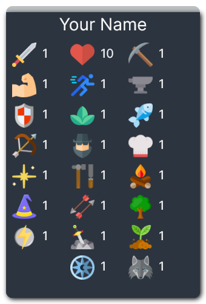

# Melvor Idle Stats

This as a Vue3 web app that converts a Melvor Idle save into a shareable image showing the stats of that character.

[Try it out here!](https://melvor-stats.vercel.app/)



You can also supply the save via the `input` URL parameter, [like so](https://melvor-stats.vercel.app/?input=H4sIAAAAAAAAA91XyXLbMAz9lQ7PTIbgKuYfeurR9iFNc8jUcTq1m4vH%2F14AlETQkR0767RDmyKxkA%2BLKHCrHtUVJK1W6mpmNDVwGugxNMuz6JPJ2XSpgyKGbaHVd1YbZPsFpPZIRRrKr1F%2BttCzcQ0tVmPqBdDP6CTGnRhnMQapACAnTk68nAQ5iXIitwS5J8hNrdSxUswJBGgNGwS9S566w%2FQz2GtGeyk77ay3brjLPo6jbRIVQAhHtzgFBv0wUVacKUIDntP9zPYxQXqP%2FdHXs2ldTonzcdgDdPcGNvojvCOZ9381isuLlF7wBpHaqwP3UiMPRvs9N%2F2H0ojg5lcvYT8Srz0jB0l88jBhZv%2BZeMCvhNrO1frn3XI5V1erP8ulnqvrm83dw6rON3f3t%2BvN9f0vJNVSJsVup7SaLbDb0miuvt4uHx9%2Bf%2Fm2ud6s54pJj3BpLh1PqiR39dwk%2Bqx8%2BY%2F%2BWH%2BuDMLAlzhn7SNWN%2Fg6Z%2BMWiBOIYX3QMWasblLAb6oB7UMjZUnK%2ByxpjmjOBdLCAs5koA5rCVxMiPkilrVzkdZGgeClQCgCCelJ0iPRaZCGQTcM8jAAU5Q7namINGQDwqHOEppEtIgrN8iBje6AATOoDlF3jYgdt2A7fYCG7YtDYkNkS3A1dHJoObHnEBTXcEbjYLQO2LzobBMBtjTHxrcWSlgNBQEXx44sRnNybsyxtgBI1YqdwmS%2B%2BUFkR17zOnqNjqQI1Yp6GJcmal1rajV5%2BD%2F0Y0Jiyapjv9pQZ7vCqF3dyFuCZE%2BARDLnYaKN5QoCay%2F8%2FJGBKSQr%2FbpUbS6dfgAJlGj4eAWKyfafUj9W6gxvau%2Fy9H6f6cjayM5%2FTV9Dn%2Bn%2BYjGXNJ4oJybO%2BVE6mDmen3v5wpejwYElwCQXGH654ZFEHqLLbgWr%2B%2Btb8n3Gwdub4gIDcqSlOwyjoT%2FGxeqEiOi9pbM39gw8voBoHQsM3NBzQ1Go1zZqVo8F11QiHm6xyZX9OXZPCN1k6p2i94RE0ZggErlFZU6m1qRAh7XiF%2BMN2IyBW%2Bz%2BAnygnk2UEAAA):

## Bulk convert svg to png

Since it was easier for me to work with PNG instead of SVG, I bulk transformed them with this command. Only summoning had to be done manually for some reason.

```
mogrify \
-path "./public/static/img/icons" \
-density 1200 \
-resize 50x50 \
-background none \
-format png \
"./public/static/img/icons/*.svg"
```
